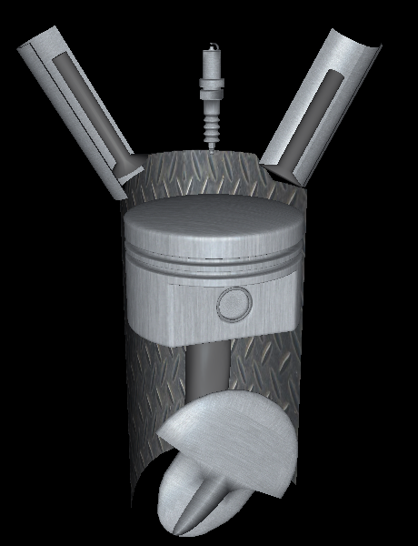
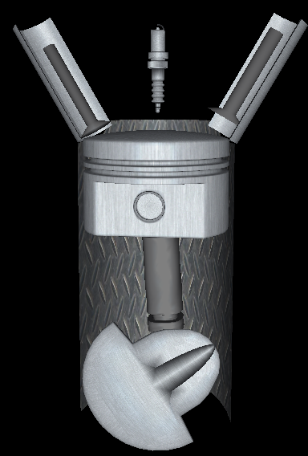
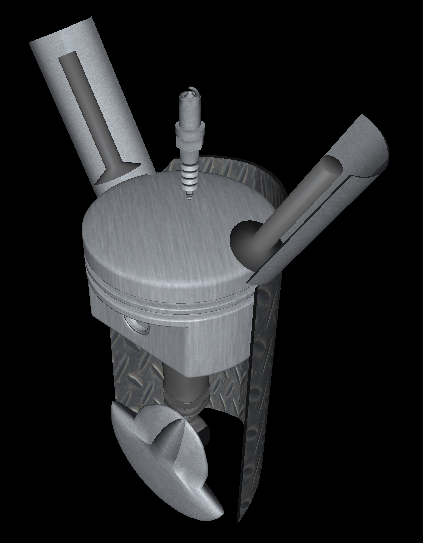
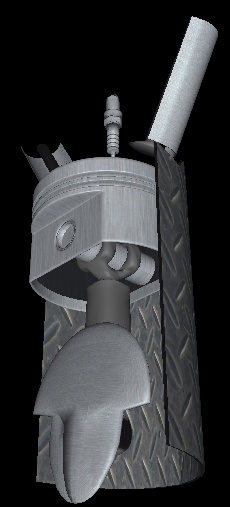

# 3D engine animation 
This is student project.

## Control
Arrows - rotate model

W - zoom in

S - zoom out

## Images

## Built with
* C++ 
* OpenGL
* Blender

## Authors
* [Tomasz Gil](https://github.com/tomaszgil)
* [Łukasz Kobyłecki](https://github.com/lukaszkobylecki)

## License
This project is licensed under the MIT License.

## Contact
If you want to know more about the project, you can contact us, for example at:
* lukaszkobylecki@wp.pl
* lukkobylecki@gmail.com
	
